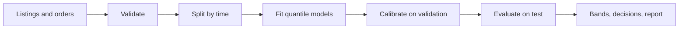
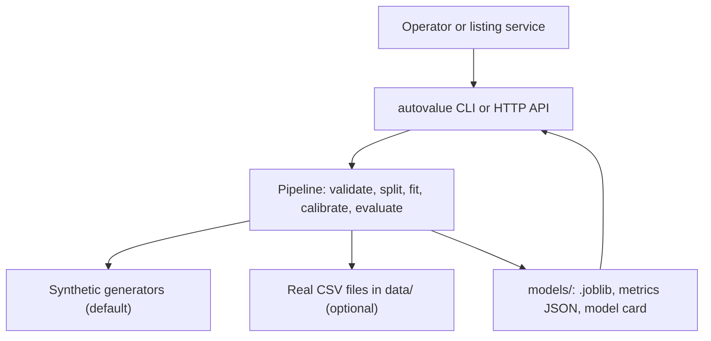
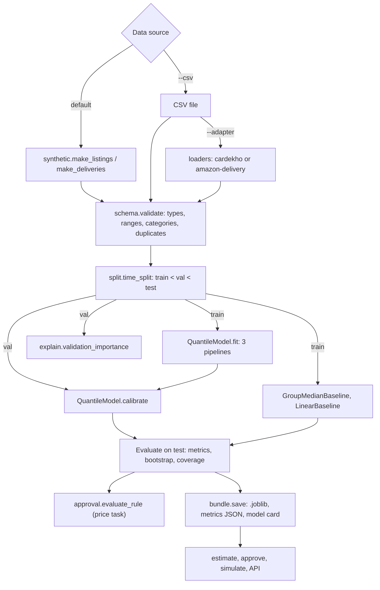

<div align="center">

# autovalue — Used-Car Price Bands, Price Approval and Delivery-Time Bands

**autovalue is a machine-learning toolkit for an online used-car marketplace. It takes listing and order tables through these steps to a price band, an approval decision and a delivery-time band:**

`validate` → `split by time` → `fit quantile models` → `calibrate` → `evaluate against baselines` → `approve or review`.


**[Summary](#1-summary)** ·
**[Workflow](#4-the-end-to-end-workflow)** ·
**[Run it](#13-how-to-run-autovalue)** ·
**[Configuration](#134-environment-variables)** ·
**[Known problems](#16-known-problems)** ·
**[Glossary](#18-glossary)**

</div>

> [!NOTE]
> This README uses ASD-STE100 Simplified Technical English. The writing rules and the project
> vocabulary are in [`docs/ste-style-guide.md`](docs/ste-style-guide.md). Each term in the
> [Glossary](#18-glossary) has only one meaning.

> [!CAUTION]
> Do not use a price band as a final price decision. A person must review each `review_low` and `review_high` listing.
> Data from one market can be biased against rare brands, regions or sellers. Audit the decisions by group.

---

autovalue gives two estimates for a used-car marketplace: the price of a listing and the delivery time of an order.
Each estimate is a band with a low, a middle and a high value, not one number.
A calibration step on held-out rows gives the band its stated coverage.
The price band drives an approval rule: a listed price inside the band is approved automatically, and other prices go to a human reviewer.
Each model must beat two baselines on a later time period, and the report shows the noise floor of the data.

This README is the **one location that explains all of autovalue**. It gives these topics:

- the general design
- each component and its procedure, step by step
- the decision rules
- the data map
- the runbook
- the validation results and the known problems

| If you are… | Read |
|---|---|
| A manager or reviewer | [1](#1-summary), [3](#3-design-rules), [4](#4-the-end-to-end-workflow), [15](#15-validation-results), [17](#17-key-points) |
| A developer who joins the project | All sections, in sequence. Keep [13](#13-how-to-run-autovalue) and [16](#16-known-problems) open while you work |
| An operator who runs autovalue | [13](#13-how-to-run-autovalue), then the section for the component that you use |

---

## Table of contents

1. 🧭 [Summary](#1-summary)
2. 🏗️ [How autovalue is built](#2-how-autovalue-is-built)
   - 2.1 [Components](#21-components)
   - 2.2 [System context](#22-system-context)
   - 2.3 [Repository layout](#23-repository-layout)
3. 🛡️ [Design rules](#3-design-rules)
4. 🔄 [The end-to-end workflow](#4-the-end-to-end-workflow)
   - 4.1 [Full flow](#41-full-flow)
   - 4.2 [The life cycle of one listing](#42-the-life-cycle-of-one-listing)
5. 📋 [The table schemas and validation](#5-the-table-schemas-and-validation)
6. 🧪 [The synthetic generators](#6-the-synthetic-generators)
7. 🔵 [Features and the time split](#7-features-and-the-time-split)
8. 🟢 [The quantile models and calibration](#8-the-quantile-models-and-calibration)
9. 🟣 [Baselines and evaluation](#9-baselines-and-evaluation)
10. ⚖️ [The approval rule](#10-the-approval-rule)
11. 🤝 [The negotiation simulation](#11-the-negotiation-simulation)
12. 🗂️ [Data and file map](#12-data-and-file-map)
13. ▶️ [How to run autovalue](#13-how-to-run-autovalue)
    - 13.1 [Prerequisites](#131-prerequisites) · 13.2 [Installation](#132-installation) · 13.3 [Run autovalue](#133-run-autovalue) · 13.4 [Environment variables](#134-environment-variables)
14. 🧩 [How to extend autovalue](#14-how-to-extend-autovalue)
15. ✅ [Validation results](#15-validation-results)
16. ⚠️ [Known problems](#16-known-problems)
17. 📌 [Key points](#17-key-points)
18. 📖 [Glossary](#18-glossary)
19. 📄 [License](#19-license)

---

## 1. Summary

**The problem.** A marketplace wants to approve fair listing prices without a manual check of each listing. It also wants a delivery-time estimate for each order. These questions are difficult:

- How do you get a label that is real and the same in each run?
- How do you keep the test rows out of all fit steps, including encoders and feature ranking?
- How do you show that a model is better than a simple rule?
- How wide must a price band be so that it holds the real price at the stated rate?
- Which listed prices can the system approve, and which prices need a human?

autovalue gives each of these questions its own component. Each component has a validated input and a tested output.

| Item | Value |
|---|---|
| Input | A listings table (one row for each car) and a deliveries table (one row for each order) |
| Output | A price band and a delivery-time band for each row, an approval decision, a JSON report and a model card |
| Components | **13** modules: config, schema, synthetic, loaders, features, split, tasks, models, evaluate, explain, approval, simulate, pipeline, plus the CLI, the bundle and the optional API |
| Models | Quantile `HistGradientBoostingRegressor` (default) or LightGBM (extra `boost`) |
| Baselines | Group median and ridge regression on the same features |
| Offline mode | All commands. The synthetic generators replace the downloads |
| Safety | The approval rule only approves a price inside the calibrated band. All other prices go to a human |
| Tests | **60** unit tests (`pytest`), 2 more skip without the optional extras |



---

## 2. How autovalue is built

### 2.1 Components

| Component | Module | Purpose |
|---|---|---|
| Settings | `src/autovalue/config.py` | Environment variables, a local `.env` loader, range checks |
| Table schemas | `src/autovalue/schema.py` | Column types and ranges, category clean-up, dropped-row report |
| Synthetic generators | `src/autovalue/synthetic.py` | Seeded listings and orders with an `oracle_*` column |
| Dataset adapters | `src/autovalue/loaders.py` | CarDekho and Amazon delivery tables to the project schema |
| Feature builders | `src/autovalue/features.py` | Age, mileage per year, listing time, haversine distance, hour, weekday |
| Time split | `src/autovalue/split.py` | Train, validation and test parts in time sequence |
| Tasks | `src/autovalue/tasks.py` | The `price` task and the `eta` task: table, target, time column, features |
| Models | `src/autovalue/models/` | `QuantileModel`, `GroupMedianBaseline`, `LinearBaseline` |
| Evaluation | `src/autovalue/evaluate.py` | MAE, RMSE, MAPE, R², bias, bootstrap intervals, paired comparison |
| Feature ranking | `src/autovalue/explain.py` | Permutation importance on the validation part |
| Approval rule | `src/autovalue/approval.py` | `auto_approve`, `review_low`, `review_high` and the rule score |
| Negotiation | `src/autovalue/simulate.py` | Seeded buyer and seller episodes over the price band of one car |
| Pipeline | `src/autovalue/pipeline.py` | Train, calibrate, evaluate and format the report |
| Model files | `src/autovalue/bundle.py` | Save and load `.joblib`, metrics JSON and model card |
| CLI | `src/autovalue/cli.py` | The `autovalue` command with 8 subcommands |
| HTTP API | `src/autovalue/api.py` | `/price/estimate`, `/price/approve`, `/eta` (extra `api`) |

### 2.2 System context



### 2.3 Repository layout

```
autovalue/
├── .github/workflows/ci.yml     # CI: Python 3.11, pip install -e ".[dev]", pytest -q
├── .env.example                 # every environment variable, all values empty
├── pyproject.toml               # package, extras (boost, api, dev), autovalue script
├── data/README.md               # sources, terms, schema (git ignores the data files)
├── docs/ste-style-guide.md      # writing rules and project vocabulary
├── src/autovalue/
│   ├── config.py  schema.py           # settings and table schemas
│   ├── synthetic.py  loaders.py       # seeded generators and dataset adapters
│   ├── features.py  split.py  tasks.py
│   ├── models/                        # quantile.py, baselines.py
│   ├── evaluate.py  explain.py        # metrics and validation feature ranking
│   ├── approval.py  simulate.py       # decision rule and negotiation
│   ├── pipeline.py  bundle.py         # train-evaluate procedure and model files
│   ├── cli.py                         # command line
│   └── api.py                         # optional FastAPI app
└── tests/                             # 62 tests (60 run without extras), no network
```

---

## 3. Design rules

### 3.1 A label never comes from the model inputs
The price label is the sale price in the listings table. The delivery label is the delivery time in a separate orders table. No code makes a label from the feature columns. The synthetic generators are documented formulas with known noise, and the report shows their noise floor.

### 3.2 The two tables stay separate
Listings and orders have different keys, schemas and models. No code joins them by row position. `schema.py` declares each table, and `tasks.py` connects each task to one table.

### 3.3 All randomness has a seed
The generators, the split fallback, the models, the bootstrap and the negotiation use `numpy.random.Generator` or `random_state` with a seed. No code uses the built-in `hash()`. A test runs the generators with two values of `PYTHONHASHSEED` and compares the labels.

### 3.4 All fit steps see the training rows only
The feature builder, the imputers, the encoders and the regressor are steps of one scikit-learn `Pipeline`. `fit` gets only the training part. The target encoder uses cross-fitting inside the training part. Feature ranking uses the validation part, and the test part is used only for the final report.

### 3.5 Each model must beat a baseline on a later period
The split is in time sequence: train, then validation, then test. The report gives the group-median baseline, the ridge baseline, the quantile model and the noise floor on the same test rows. A paired bootstrap tells if the difference to the best baseline is real.

### 3.6 A band has a stated coverage
Three quantile models give the low, middle and high values. Conformalized quantile regression on the validation part moves the low and high values, so that the band holds the real value at the nominal rate.

### 3.7 A human decides each doubtful price
The approval rule approves only a price inside the calibrated band. A price below or above the band goes to manual review with the distance to the band.

---

## 4. The end-to-end workflow

### 4.1 Full flow



### 4.2 The life cycle of one listing

1. The seller gives the car data and a listed price.
2. `coerce_input` checks the required columns and cleans the categories.
3. The feature builder calculates the age, the mileage per year and the listing time.
4. The three pipelines give the raw low, middle and high values on the log scale.
5. The code sorts the three values, applies the calibration offset and converts them to prices.
6. `decide` compares the listed price with the band.
7. A price inside the band gets `auto_approve`. Other prices get `review_low` or `review_high`.
8. Optionally, `simulate` runs the negotiation for the same band.

---

## 5. The table schemas and validation

**Purpose.** Accept only rows that the models can use, and report each dropped row.

| Input | Output |
|---|---|
| A pandas table with source columns | The clean table and a `ValidationReport` |

**Procedure**

1. Stop with `SchemaError` if a required column is absent.
2. Coerce each column to its type: number, category, boolean, date or date-time.
3. Clean each category: strip spaces, change to lower case, join words with `_`, map known aliases.
4. Drop a row if a required value is missing or outside its range.
5. Set an optional value outside its range to NaN and record a warning.
6. Drop duplicate IDs. Keep the first row.
7. Apply the table rule: a model year after the listing year + 1, or a pickup before the order, drops the row.

**Rules**

| Table | Column | Type | Required | Range |
|---|---|---|---|---|
| listings | `listing_id` | ID | Yes | — |
| listings | `listed_at` | date | Yes | — |
| listings | `brand`, `model`, `fuel`, `transmission` | category | Yes | — |
| listings | `year` | number | Yes | 1980 to 2100 |
| listings | `odometer_km` | number | Yes | 0 to 2,000,000 |
| listings | `owners` | number | No | 1 to 15 |
| listings | `accidents` | boolean | No | — |
| listings | `engine_l` | number | No | 0.5 to 8.5 |
| listings | `body_type`, `city` | category | No | — |
| listings | `price` | number | Yes | 1 to 10⁹ |
| deliveries | `order_id` | ID | Yes | — |
| deliveries | `store_lat`, `drop_lat` | number | Yes | −90 to 90 |
| deliveries | `store_lon`, `drop_lon` | number | Yes | −180 to 180 |
| deliveries | `ordered_at`, `picked_at` | date-time | Yes | pickup ≥ order |
| deliveries | `traffic` | category | Yes | — |
| deliveries | `weather`, `area`, `vehicle` | category | No | — |
| deliveries | `delivery_minutes` | number | Yes | 1 to 1,440 |

| Source value | Clean value |
|---|---|
| `'High '`, `'Jam '` | `high`, `jam` |
| `'Metropolitian '` | `metropolitan` |
| `'Semi-Urban'` | `semi_urban` |
| `''`, `'nan'`, `'none'` | NaN |

Columns that are not in the schema pass through without change. `coerce_input` uses the same coercion for new rows, but it drops no row. It raises `SchemaError` with the column name if a required feature is absent.

---

## 6. The synthetic generators

**Purpose.** Give the demo and the tests realistic tables with no download and a known noise floor.

| Function | Output columns | Label | Noise |
|---|---|---|---|
| `make_listings(n, seed, dirty)` | listings schema + `oracle_price` | `price` | log-normal, σ = `PRICE_NOISE_SIGMA` = 0.12 |
| `make_deliveries(n, seed, dirty)` | deliveries schema + `oracle_minutes` | `delivery_minutes` | normal, SD = `DELIVERY_NOISE_SD` = 6 minutes |

**Procedure for the price label**

1. Get the base price of the brand and the multiplier of the model.
2. Apply a depreciation of 9 % for each year of age (16 % for `bmw` and `mercedes`).
3. Apply a saturating mileage factor: `exp(-0.18 × log1p(km / 20,000))`.
4. Apply the fuel, transmission, body, city, owner and accident factors.
5. Apply a market trend of +4 % for each year after 2021-01-01.
6. Multiply by the log-normal noise and round to 100.

**Procedure for the delivery label**

1. Calculate the haversine distance between the store and the drop point.
2. Multiply 3.2 minutes per km by the traffic, weather and vehicle factors.
3. Add 12 minutes, the pickup wait, the area time and 9 minutes in the peak hours 17 to 21.
4. Add the normal noise. Round, and keep a minimum of 5 minutes.

**Rules**

- With `dirty=True`, the listings get padded and mixed-case categories, 3 % missing `engine_l`, 2 % missing `body_type`, 0.5 % negative odometers and 1 % duplicate rows.
- With `dirty=True`, the orders get the trailing spaces of the public delivery data (`'High '`, `'Metropolitian '`) and 2 % missing `weather`.
- The `oracle_*` column holds the label without noise. Only the evaluation reads it.

---

## 7. Features and the time split

**Purpose.** Change the clean rows into model features with no fitted state, and cut the rows by time.

| Builder | Numeric features | Category features | High-cardinality feature |
|---|---|---|---|
| `CarFeatures` | `age_years`, `odometer_km`, `km_per_year`, `owners`, `accidents`, `engine_l`, `listing_time` | `brand`, `fuel`, `transmission`, `body_type`, `city` | `brand_model` |
| `DeliveryFeatures` | `distance_km`, `pickup_wait_min`, `order_hour`, `order_weekday`, `is_weekend`, `is_peak` | `weather`, `traffic`, `area`, `vehicle` | — |

**Procedure of the time split**

1. Read the time column of the task: `listed_at` or `ordered_at`.
2. Calculate the cut times at the 70 % and 85 % quantiles of time.
3. Put rows before the first cut in train, rows between the cuts in validation, and later rows in test.
4. If the time column has fewer than 3 distinct values, do a seeded random split and record a note.

**Rules**

- Dates and times become numbers. No date or time text is label-encoded.
- Rows with the same timestamp stay in one part.
- The builders are stateless. `fit` changes nothing, so they cannot learn from any rows.

---

## 8. The quantile models and calibration

**Purpose.** Give a low, a middle and a high estimate with a stated coverage.

| Step | Object | Fit on |
|---|---|---|
| Feature builder | `CarFeatures` or `DeliveryFeatures` | — (stateless) |
| Numeric imputer | `SimpleImputer(strategy="median")` | train |
| Category encoder | `OneHotEncoder(min_frequency=10, handle_unknown="infrequent_if_exist")` | train |
| Brand-model encoder | `TargetEncoder(target_type="continuous")`, cross-fitted | train |
| Regressor | `HistGradientBoostingRegressor(loss="quantile")` or `LGBMRegressor(objective="quantile")` | train |
| Calibration offset | Conformalized quantile regression | validation |

**Procedure**

1. Fit one pipeline for each quantile: `AUTOVALUE_BAND_LOW`, 0.5 and `AUTOVALUE_BAND_HIGH`.
2. For the price task, fit on the natural log of the price.
3. On the validation part, calculate the score `max(low − y, y − high)` for each row.
4. Set the offset to the ⌈(n + 1)(1 − α)⌉ / n quantile of the scores, with α = 1 − (high − low).
5. At prediction, sort the three values, subtract the offset from the low value and add it to the high value.
6. Convert the values back to prices with `exp` (price task only).

**Rules**

- The three values never cross, because the code sorts them.
- A negative offset makes the band narrower. A positive offset makes it wider.
- The middle value stays inside the band.

---

## 9. Baselines and evaluation

**Purpose.** Show if the model is better than a simple rule, and how near it is to the best possible error.

| Model | How it predicts |
|---|---|
| `group_median` | Median label of the most specific group with at least 5 training rows. Price: brand-model-year, brand-model, brand, all. Delivery: traffic-area, traffic, all |
| `linear` | Ridge regression (α = 1) on the same features, with one-hot categories and scaled numbers |
| `quantile_gbm` | The middle value of the calibrated band |
| `oracle_noise_floor` | The `oracle_*` column. Only for synthetic data |

| Metric | Meaning |
|---|---|
| MAE, with a 95 % bootstrap interval | Mean absolute error |
| RMSE, MAPE, R² | Usual regression metrics |
| Bias, with a 95 % bootstrap interval | Mean of (prediction − actual). It tells the direction of the error, not the accuracy |
| Paired MAE difference | MAE(model) − MAE(best baseline), paired bootstrap. A negative upper bound means that the model is better |
| Coverage, mean width, mean relative width | Band quality before and after calibration |
| Validation importance | Increase of the MAE of the middle model when one input column is shuffled, on the validation part |

**Rules**

- A paired t-test between predictions and actual values is not used. It tests only the mean error, so an unbiased model with large errors passes it. A test shows this case.
- The report always gives the baselines and the model on the same test rows.

---

## 10. The approval rule

**Purpose.** Approve fair prices automatically and send doubtful prices to a human.

| Condition | Decision | Reason text |
|---|---|---|
| `low ≤ listed price ≤ high` | `auto_approve` | `price is inside the band` |
| `listed price < low` | `review_low` | `price is <amount> below the band` |
| `listed price > high` | `review_high` | `price is <amount> above the band` |
| `listed price ≤ 0` or `low > mid` or `mid > high` | `ValueError` | — |

**Procedure of the rule score**

1. Copy the test listings.
2. Select a seeded 30 % of the rows and mark them as mispriced.
3. Multiply each mispriced price by a factor from 0.45 to 0.7 or from 1.45 to 2.2.
4. Apply the rule to each row with the band of the car.
5. Count a review decision as a positive prediction of "mispriced".
6. Report the auto-approve rate, the precision, the recall and the false review rate.

---

## 11. The negotiation simulation

**Purpose.** Show how a seller and buyers act when the price band of one actual car is known.

| Input | Output |
|---|---|
| The band of the car, an asking price, the number of episodes, a seed | Deal rate, mean deal price, mean rounds, deal price / middle value |

**Procedure**

1. Get the band of the car from the price model.
2. If the ask is above the middle value, move the offer toward the middle value by 20 % of the gap in each round. Never offer below the low value.
3. If the ask is at or below the middle value, keep the offer at the ask.
4. For each episode, draw the private value of the buyer from a triangular distribution over the band.
5. The buyer accepts the first offer at or below the private value, in a maximum of 10 rounds.

---

## 12. Data and file map

| Path | Committed? | Contents |
|---|---|---|
| `data/README.md` | Yes | Sources, terms and schema |
| `data/*.csv` | No (git ignores it) | Synthetic or downloaded tables |
| `models/<task>.joblib` | No (git ignores it) | The calibrated `QuantileModel` and its metadata |
| `models/<task>_metrics.json` | No (git ignores it) | The full report of `train` |
| `models/<task>_model_card.md` | No (git ignores it) | Short model card with data source and limits |
| `.env` | No (git ignores it) | Local settings |
| `.env.example` | Yes | All variable names, no values |

---

## 13. How to run autovalue

### 13.1 Prerequisites

| Need | For |
|---|---|
| Python 3.11+ | All components |
| `numpy`, `pandas`, `scikit-learn>=1.4` | Core (installed with the package) |
| `lightgbm` (extra `boost`) | `AUTOVALUE_BACKEND=lightgbm` (optional) |
| `fastapi`, `uvicorn`, `httpx` (extra `api`) | `autovalue serve` (optional) |

### 13.2 Installation

```bash
git clone https://github.com/KrishnaAnnavaram/autovalue.git
cd autovalue
python -m venv .venv
. .venv/bin/activate            # Windows: .venv\Scripts\activate
pip install -e ".[dev]"         # add ,boost,api for the optional parts
```

### 13.3 Run autovalue

Offline (no key, no network):

```bash
autovalue demo                                    # train and evaluate both tasks on synthetic data
autovalue generate --out data                     # write data/listings.csv and data/deliveries.csv
autovalue validate --table listings --csv data/listings.csv
autovalue train --task price --csv data/listings.csv --out models
autovalue train --task eta --synthetic 4000 --out models
autovalue estimate --model models/price.joblib --input '{"listed_at": "2024-11-15", "brand": "Hyundai", "model": "Creta", "year": 2019, "odometer_km": 48000, "fuel": "Diesel", "transmission": "Automatic"}'
autovalue approve --model models/price.joblib --input car.json --price 650000
autovalue simulate --model models/price.joblib --input car.json --ask 900000 --episodes 2000
autovalue estimate --model models/eta.joblib --input order.json
```

With real data and the optional extras:

```bash
autovalue train --task price --csv "data/CAR DETAILS FROM CAR DEKHO.csv" --adapter cardekho
autovalue train --task eta --csv data/amazon_delivery.csv --adapter amazon-delivery
AUTOVALUE_BACKEND=lightgbm autovalue train --task eta --csv data/amazon_delivery.csv --adapter amazon-delivery
autovalue serve --price-model models/price.joblib --eta-model models/eta.joblib --port 8000
```

| Command | What it does |
|---|---|
| `demo` | Generates both tables, trains, calibrates and evaluates both tasks, prints an example decision |
| `generate` | Writes the synthetic CSV files |
| `validate` | Prints the validation report of a CSV |
| `train` | Validates, splits, fits, calibrates, evaluates and saves the model files |
| `estimate` | Prints the band of each input row (car or order) |
| `approve` | Prints the decision for one car and one listed price |
| `simulate` | Prints the negotiation summary for one car |
| `serve` | Starts the HTTP API (extra `api`) |

The `--input` value is a JSON object, a JSON list or the path of a `.json` file.

### 13.4 Environment variables

| Variable | Used by | Meaning |
|---|---|---|
| `AUTOVALUE_SEED` | All components | Seed of the models, the bootstrap and the rule score. Default 42 |
| `AUTOVALUE_DATA_DIR` | `generate` | Output folder when `--out` is not given. Default `data` |
| `AUTOVALUE_MODEL_DIR` | `train` | Output folder when `--out` is not given. Default `models` |
| `AUTOVALUE_BAND_LOW` | Quantile models | Low quantile. Default 0.10. Must be in (0, 0.5) |
| `AUTOVALUE_BAND_HIGH` | Quantile models | High quantile. Default 0.90. Must be in (0.5, 1) |
| `AUTOVALUE_BACKEND` | Quantile models | `sklearn` (default) or `lightgbm` |
| `AUTOVALUE_MAX_ITER` | Quantile models | Boosting iterations. Default 300, minimum 10 |

The CLI reads a local `.env` file. A variable that is already in the environment wins. A value that is not valid stops the command with `error:`. autovalue needs no credentials.

---

## 14. How to extend autovalue

| You want to… | Do this | Code change? |
|---|---|---|
| Train on your own listings | Export a CSV with the listings schema and run `train --csv` | No |
| Use a different band, for example P05–P95 | Set `AUTOVALUE_BAND_LOW=0.05` and `AUTOVALUE_BAND_HIGH=0.95` | No |
| Use LightGBM | Install the extra `boost` and set `AUTOVALUE_BACKEND=lightgbm` | No |
| Add a public dataset | Write an adapter function in `loaders.py` and add it to `ADAPTERS` | Small |
| Add a feature | Add the column to the schema and to the builder lists in `features.py` | Small |
| Add a task (for example days on market) | Add a `Task` in `tasks.py` with its table, target and builder | Yes |

Planned milestones (not built):

- **M6:** a market index for each month, so that the tree models follow a price trend.
- **M7:** a real joined key between listings and car deliveries, with a delivery-days target.
- **M8:** monitoring of band coverage on new listings, with an alert when it drops.

---

## 15. Validation results

All numbers come from the **synthetic** data. They do not describe a real market.

| Validation | Result | Command |
|---|---|---|
| Unit tests (CI installs only `.[dev]`) | **60 passed**, 2 skipped (extras `boost` and `api` absent) | `pytest -q` |
| Price, test MAE (448 rows) | quantile model 83,746 · ridge 101,643 · group median 285,742 · noise floor 58,966 | `autovalue demo` |
| Price, MAPE / R² | quantile model 0.126 / 0.930 · noise floor 0.102 / 0.975 | `autovalue demo` |
| Price, model − ridge MAE | −17,897, 95 % CI [−32,748, −4,882]: model better | `autovalue demo` |
| Price, band coverage (nominal 0.80) | 0.621 before calibration, 0.790 after | `autovalue demo` |
| Approval rule (30 % mispriced) | auto-approve 0.580, precision 0.670, recall 0.900, false review rate 0.201 | `autovalue demo` |
| Delivery, test MAE (450 rows) | quantile model 5.5 min · ridge 5.8 · group median 15.4 · noise floor 4.9 | `autovalue demo` |
| Delivery, model − ridge MAE | −0.3 min, 95 % CI [−0.6, −0.1]: model better | `autovalue demo` |
| Delivery, band coverage (nominal 0.80) | 0.589 before calibration, 0.776 after | `autovalue demo` |

The demo uses 3,000 rows for each table, seed 42 and 300 iterations.
The numbers prove that the pipeline is connected correctly and that the calibration repairs the coverage.
They also show that the model learns the non-linear parts of the generator.
They do not prove any result on real listings or real orders.
The price models have a negative bias on the test period (about −7 % for the quantile model), because the trees cannot extend the market trend.
The prototype reported a price R² of 0.9999 (prototype result, not reproduced here). That value came from a near-deterministic synthetic price and is not comparable.

---

## 16. Known problems

Read these problems before you use autovalue in production.

| # | Area | Problem | Impact and action |
|---|---|---|---|
| 1 | Data | CI and the demo use only synthetic data. Results on the real datasets are not reproduced in CI | Run `train` with the adapters and read the report before you trust a band |
| 2 | Trend | Tree models cannot extend a price trend into a later period. The synthetic test shows a bias of about −7 % | Retrain often, or add a market index (M6) |
| 3 | Coverage | The calibration uses the validation period. If the market moves, coverage on the test period is lower (0.776 to 0.790 for a nominal 0.80) | Calibrate again on recent rows before each release |
| 4 | Approval | With an 80 % band, about 20 % of fair listings go to review | Choose the band width from the review capacity of your team |
| 5 | Delivery data | The public delivery data is about parcel orders, not car deliveries | Replace it with your own car delivery logs (M7) |
| 6 | CarDekho | The CarDekho table has no listing date and no city, so the split is random | Use a source with listing dates for a real time split |
| 7 | Importance | Permutation of one coordinate column breaks the distance, so the four coordinate columns get similar high scores | Read the coordinates as one group |
| 8 | Responsible use | A price band is advice for a human reviewer. Data from one market can be biased against rare brands, regions or sellers | Keep the human review for all `review_*` decisions and audit the decisions by group |

---

## 17. Key points

1. **No label comes from the model inputs.** Each table has its own real or documented label.
2. **All randomness has a seed.** The labels are identical for each value of `PYTHONHASHSEED`.
3. **All fit steps see the training rows only.** The preprocessing is part of the model pipeline, and feature ranking uses the validation part.
4. **Each model meets two baselines and the noise floor on a later period.** A paired bootstrap tells if the difference is real.
5. **The band is calibrated.** Conformalized quantile regression gives the band its stated coverage on new rows.
6. **A human decides each doubtful price.** The rule approves only prices inside the band.

---

## 18. Glossary

| Term | Meaning |
|---|---|
| **Approval rule** | The rule that gives `auto_approve`, `review_low` or `review_high` for a listed price |
| **Band** | The low, middle and high values of one estimate |
| **Baseline** | A simple model that the quantile model must beat: group median or ridge |
| **Calibration** | The change of the band on the validation part so that the coverage is nominal |
| **Coverage** | The fraction of rows with the actual value inside the band |
| **Listing** | One car offered for sale, one row of the listings table |
| **Listed price** | The price that the seller asks for |
| **Noise floor** | The error of the label without noise. No model can be better on average |
| **Order** | One delivery, one row of the deliveries table |
| **Quantile model** | A gradient-boosting model that predicts one quantile of the label |
| **Task** | `price` or `eta`: one table, one target and one feature builder |
| **Time split** | The cut of the rows into train, validation and test parts in time sequence |

---

## 19. License

[MIT](LICENSE) © 2026 Krishna Annavaram
